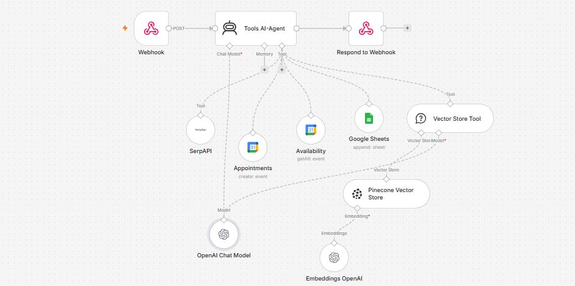

# 🎙️ AI Voice Agent using n8n, OpenAI, Pinecone, Google Calendar & SerpAPI


---

# 📖 Overview

This workflow demonstrates how to build an intelligent **Voice AI Assistant** capable of handling real-world conversations using Retrieval-Augmented Generation (RAG) and multiple external tools.

The AI Agent receives user requests through a webhook endpoint and uses OpenAI to understand the user's intent. Depending on the request, it can retrieve relevant knowledge from a Pinecone Vector Store, perform live internet searches using SerpAPI, check Google Calendar availability, schedule appointments, and store conversation records in Google Sheets.

By combining conversational AI, vector search, calendar automation, and web search into a single workflow, this solution enables organizations to build scalable AI assistants for appointment booking, customer support, knowledge retrieval, and business automation.
---

# 🖼️ Workflow Layout



---


# ✨ Features

* 🎙️ AI-powered voice assistant backend
* 🤖 OpenAI GPT reasoning
* 🧠 Retrieval-Augmented Generation (RAG)
* 📚 Pinecone Vector Database integration
* 🔎 Live web search using SerpAPI
* 📅 Google Calendar availability checking
* 📆 Automatic appointment scheduling
* 📄 Conversation logging in Google Sheets
* 🔗 Webhook API endpoint
* ⚡ Intelligent tool selection
* 🌍 Real-time information retrieval
* 📈 Scalable AI assistant architecture

---

# 💼 Business Problem Solved

Businesses often require an intelligent assistant capable of answering customer questions, retrieving company knowledge, searching the web for up-to-date information, and scheduling appointments without human intervention.

Traditional chatbots are limited to predefined responses and cannot access dynamic information or company-specific knowledge.

This AI Voice Agent solves these challenges by integrating multiple AI-powered tools into a unified conversational workflow. It can understand natural language, retrieve contextual information from a vector database, access live web search results, manage appointments, and maintain structured conversation records.

---

# 🛠️ Technologies Used

| Technology        | Purpose                        |
| ----------------- | ------------------------------ |
| n8n               | Workflow automation            |
| OpenAI GPT-4o     | Natural language understanding |
| OpenAI Embeddings | Vector embeddings generation   |
| Pinecone          | Vector database for RAG        |
| Google Calendar   | Appointment scheduling         |
| Google Sheets     | Conversation logging           |
| SerpAPI           | Live web search                |
| Webhook           | REST API endpoint              |
| JSON              | Data exchange format           |

---

# 🔧 Prerequisites

Before importing the workflow into n8n, ensure you have:

* Latest version of n8n
* OpenAI API Key
* Pinecone Account and Index
* Google Cloud Project
* Google Calendar API enabled
* Google Sheets API enabled
* SerpAPI Key
* Internet connection

---

# 🔐 Required Credentials

## 🤖 OpenAI

### Required

* OpenAI API Key

### Used For

* Intent detection
* AI reasoning
* Response generation
* Embedding generation

---

## 📚 Pinecone

### Required

* API Key
* Environment
* Index Name

### Used For

* Vector search
* Company knowledge retrieval
* RAG implementation

---

## 📅 Google Calendar

### Required

* OAuth2 Credentials

### Used For

* Check availability
* Create appointments
* Retrieve calendar events

---

## 📄 Google Sheets

### Required

* OAuth2 Credentials

### Used For

* Store user conversations
* Log appointment details
* Maintain interaction history

---

## 🔎 SerpAPI

### Required

* API Key

### Used For

* Live Google Search
* Real-time information retrieval

---

# 🚀 Installation

## 1️⃣ Import Workflow

Import the `workflow.json` file into your n8n instance.

---

## 2️⃣ Configure OpenAI

Create OpenAI credentials and connect them to:

* OpenAI Chat Model
* OpenAI Embeddings

---

## 3️⃣ Configure Pinecone

Provide:

* API Key
* Index Name
* Environment

Connect the credentials to the Pinecone Vector Store node.

---

## 4️⃣ Configure Google Credentials

Authorize:

* Google Calendar
* Google Sheets

using OAuth2 credentials.

---

## 5️⃣ Configure SerpAPI

Add your SerpAPI API Key to the SerpAPI node.

---

## 6️⃣ Activate Workflow

Once all credentials are configured, activate the workflow.

The AI Voice Agent is now ready to receive requests through its webhook endpoint.

---

# 🌐 API Endpoint

Example:

```text
POST /webhook/voice-ai-agent
```

### Sample Request

```json
{
  "user": "John Doe",
  "message": "Book a meeting tomorrow at 3 PM and check if I'm available."
}
```

### Sample Response

```json
{
  "status": "success",
  "message": "Your appointment has been scheduled successfully."
}
```

---
# 📚 Node-by-Node Documentation

This section explains each node used in the AI Voice Agent workflow, including its purpose, configuration, inputs, outputs, and how it contributes to the overall conversational experience.

---

# 1️⃣ 🌐 Webhook

**Node Type:** Webhook

## 🎯 Purpose

Acts as the public REST API endpoint that receives user requests from external applications such as voice assistants, websites, mobile applications, or chatbots.

Every conversation begins from this node.

---

### ⚙️ Configuration

| Parameter      | Value              |
| -------------- | ------------------ |
| HTTP Method    | POST               |
| Response Mode  | Respond to Webhook |
| Path           | `/voice-ai-agent`  |
| Authentication | Optional           |

---

### 📥 Example Request

```json
{
  "user":"John Doe",
  "message":"Book a meeting tomorrow at 3 PM."
}
```

---

### 📤 Output

The incoming JSON payload is forwarded to the AI Agent.

---

# 2️⃣ 🤖 Tools AI Agent

**Node Type:** AI Agent

## 🎯 Purpose

The AI Agent is the brain of the workflow.

It understands user requests, selects the correct tool, gathers information from connected services, and generates a conversational response.

---

### Connected Tools

* OpenAI Chat Model
* Pinecone Vector Store
* SerpAPI
* Google Calendar
* Google Sheets

---

### Responsibilities

* Intent detection
* Conversation reasoning
* Tool selection
* Multi-step decision making
* Response generation

---

### Example User Requests

```text
What are your business hours?
```

```text
Book an appointment tomorrow at 4 PM.
```

```text
Search latest AI news.
```

```text
Tell me your refund policy.
```

---

# 3️⃣ 🧠 OpenAI Chat Model

**Node Type:** OpenAI Chat Model

## 🎯 Purpose

Provides natural language understanding and reasoning capabilities.

---

### Configuration

| Parameter   | Value        |
| ----------- | ------------ |
| Model       | GPT-4o       |
| Temperature | 0.2          |
| Max Tokens  | Configurable |

---

### Used For

* Intent detection
* AI reasoning
* Conversational responses
* Tool routing

---

# 4️⃣ 🔎 SerpAPI

**Node Type:** Tool

## 🎯 Purpose

Allows the AI Agent to retrieve live information from Google Search whenever internal knowledge is insufficient.

---

### Typical Searches

* Weather
* News
* Company information
* Product details
* Latest technology updates

---

### Example Prompt

```text
Latest AI Automation Trends
```

---

### Example Output

```json
{
    "title":"Top AI Automation Tools",
    "url":"https://example.com",
    "snippet":"Recent advances in AI..."
}
```

---

# 5️⃣ 📅 Availability (Google Calendar)

**Node Type:** Google Calendar

## 🎯 Purpose

Checks the user's calendar before scheduling a new appointment.

This prevents double bookings.

---

### Operation

```text
Get Events
```

---

### Parameters

| Parameter  | Description |
| ---------- | ----------- |
| Calendar   | Primary     |
| Start Time | Dynamic     |
| End Time   | Dynamic     |

---

### Example Response

```json
{
    "available":true
}
```

---

# 6️⃣ 📆 Appointments (Google Calendar)

**Node Type:** Google Calendar

## 🎯 Purpose

Creates a new calendar event once the requested time slot is available.

---

### Operation

```text
Create Event
```

---

### Important Parameters

| Parameter  | Value          |
| ---------- | -------------- |
| Calendar   | Primary        |
| Summary    | AI Appointment |
| Start Time | Dynamic        |
| End Time   | Dynamic        |
| Attendees  | Optional       |

---

### Example Output

```json
{
    "eventId":"abc123",
    "status":"confirmed"
}
```

---

# 7️⃣ 📄 Google Sheets

**Node Type:** Google Sheets

## 🎯 Purpose

Stores conversation logs and appointment details for future reporting and auditing.

---

### Operation

```text
Append Row
```

---

### Suggested Columns

| Column           |
| ---------------- |
| Timestamp        |
| User Name        |
| User Query       |
| AI Response      |
| Appointment Date |
| Appointment Time |
| Status           |

---

### Example Row

| Timestamp  | User | Query        | Response       | Date   | Time | Status    |
| ---------- | ---- | ------------ | -------------- | ------ | ---- | --------- |
| 2026-07-19 | John | Book Meeting | Meeting Booked | 20-Jul | 3 PM | Confirmed |

---

# 8️⃣ 📚 Vector Store Tool

**Node Type:** AI Tool

## 🎯 Purpose

Allows the AI Agent to retrieve company knowledge from Pinecone using semantic search.

Instead of keyword matching, the tool finds information based on meaning.

---

### Example Questions

```text
What services does the company offer?
```

```text
Tell me about pricing.
```

```text
Explain your cancellation policy.
```

---

# 9️⃣ 🧠 Pinecone Vector Store

**Node Type:** Pinecone Vector Database

## 🎯 Purpose

Stores vector embeddings representing company documents.

The AI Agent retrieves the most relevant chunks to answer user questions.

---

### Configuration

| Parameter         | Value             |
| ----------------- | ----------------- |
| Index             | Company Knowledge |
| Namespace         | Default           |
| Similarity Search | Cosine            |

---

### Stored Data

* FAQs
* Policies
* Product documentation
* Knowledge base
* Company information

---

# 🔟 🧮 OpenAI Embeddings

**Node Type:** OpenAI Embeddings

## 🎯 Purpose

Converts text into numerical vector embeddings before storing or searching within Pinecone.

---

### Model

```text
text-embedding-3-small
```

---

### Used For

* Document indexing
* Semantic search
* Retrieval-Augmented Generation

---

# 🌍 Use Cases

* 🎙️ AI Voice Receptionist
* 📅 Appointment Booking Assistant
* 🏥 Healthcare Scheduling
* 🏢 Business Customer Support
* 📚 Knowledge Base Assistant
* 🎓 Educational Information Bot
* 🛍️ E-commerce Customer Assistant
* 💼 Internal Company Helpdesk

---

# 🎯 Benefits

* 🤖 Natural conversational AI
* 📚 Accurate answers using RAG
* 🌐 Real-time internet search
* 📅 Automatic scheduling
* 📄 Conversation logging
* ⚡ Modular and scalable architecture

---

# 🛠️ Customization Ideas

* 📧 Send email confirmations
* 📱 SMS or WhatsApp reminders
* 🔊 Speech-to-Text integration
* 🎤 ElevenLabs voice responses
* 💳 Payment booking support
* 🌍 Multi-language conversations
* 📈 Analytics dashboard
* ☁️ CRM integration

---

# ⚠️ Troubleshooting

| Problem                     | Cause                             | Solution                                 |
| --------------------------- | --------------------------------- | ---------------------------------------- |
| AI Agent doesn't answer     | Missing OpenAI API key            | Verify credentials                       |
| Pinecone returns no results | Empty index                       | Upload documents and generate embeddings |
| Calendar booking fails      | OAuth expired                     | Reconnect Google Calendar                |
| Google Sheets append fails  | Invalid sheet ID                  | Verify Spreadsheet configuration         |
| SerpAPI returns empty data  | Invalid API key or quota exceeded | Check API credentials                    |
| Webhook returns 404         | Workflow inactive                 | Activate the workflow                    |

---

# 🚀 Future Improvements

* 🗣️ Full Speech-to-Speech conversations
* 🎭 Voice cloning with ElevenLabs
* 📧 Email confirmations after booking
* 📱 WhatsApp and Telegram integrations
* 🧠 Long-term conversation memory
* 🌐 Multi-language support
* 📊 Admin analytics dashboard
* 🔐 User authentication and role-based access

---

# 🤝 Contributing

Contributions, bug reports, feature requests, and pull requests are welcome. Feel free to fork the repository and help improve this workflow.

---

# ⭐ Support

If you found this workflow helpful, consider giving the repository a **⭐ Star** on GitHub. It helps others discover the project and encourages continued development of open-source n8n AI automation workflows.
